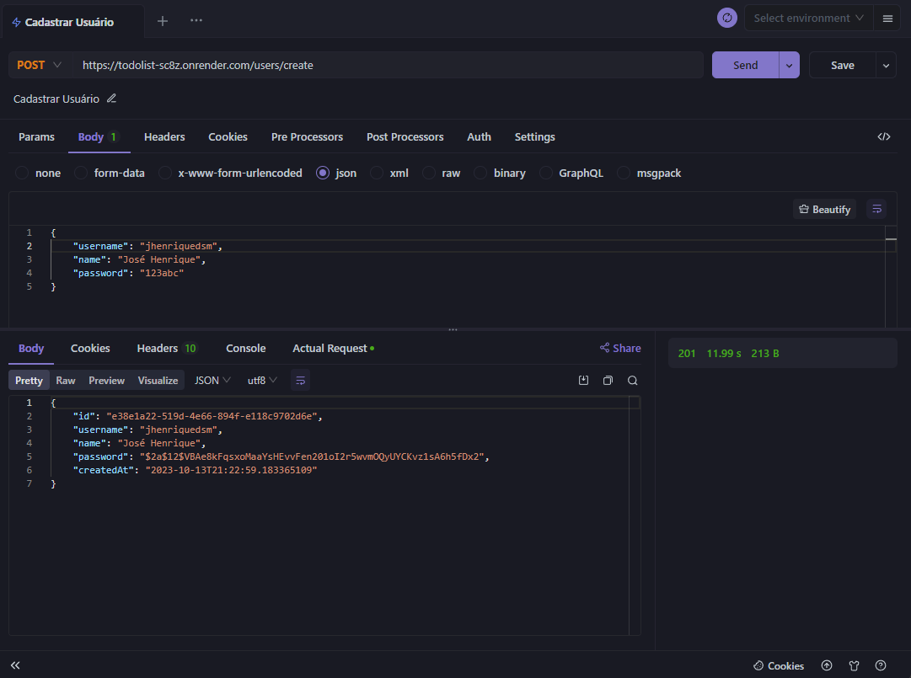
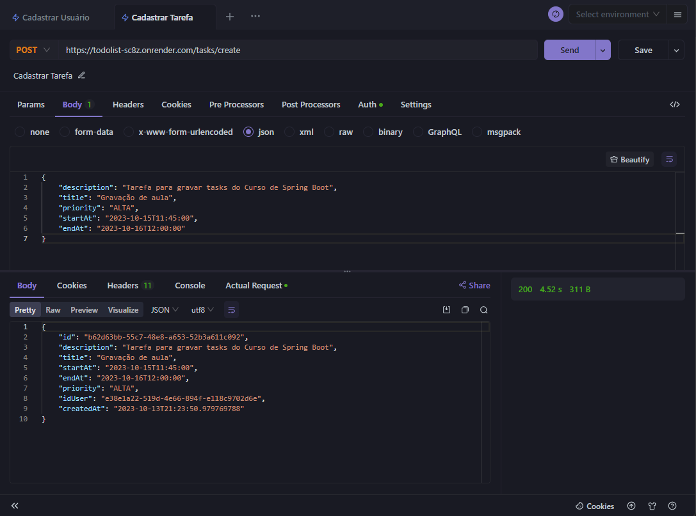
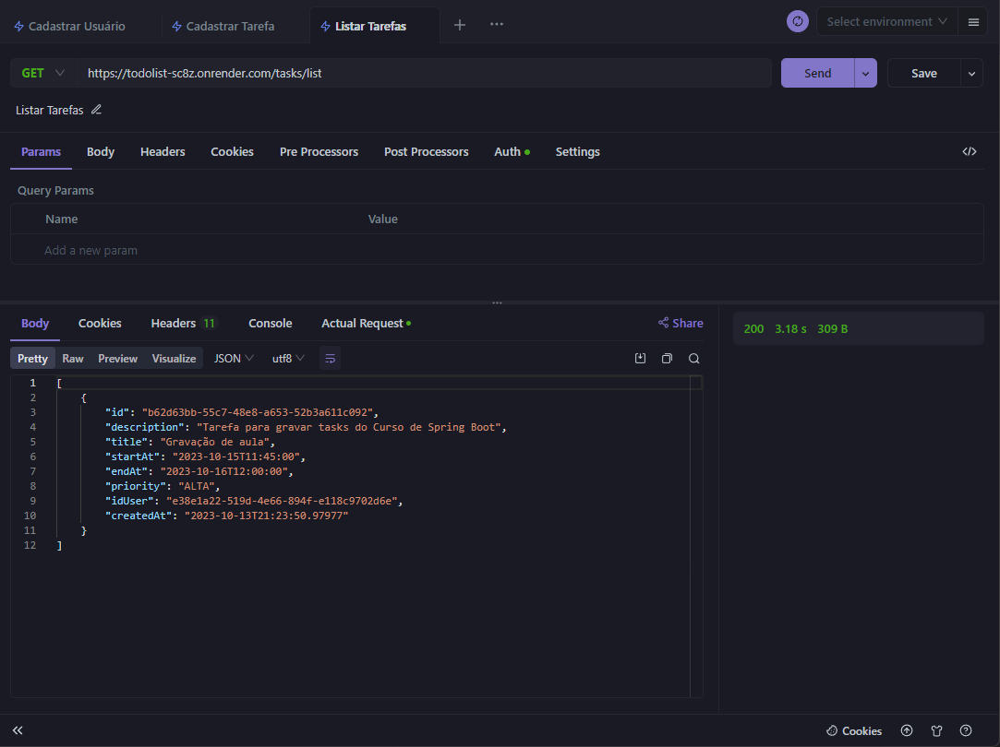
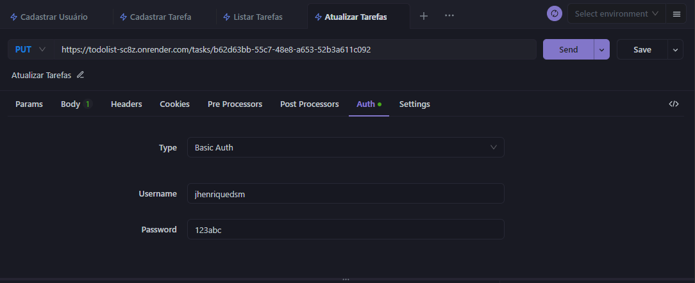

# CURSO ONLINE DE JAVA - ROCKETSEAT 

## Dependências utilizadas
- Spring Web
- Spring DevTools
- Spring Data Jpa
- Lombok
- H2 Database
- BCrypt

## Tecnologias utilizadas
- Java
- Spring
- Apidog
- VS Code

## Conteúdo das aulas
### Aula 01 - Construçao back-end de uma aplicação de To-Do List
- Configurando o ambiente
- Criando estrutura
- Entendendo Controller
- Funcionalidade Usuário
### Aula 02 - Integração com Banco de Dados
- Getter and Setter
- Lombok
- H2 Banco
- Tabela Usuário
- Repository
- Validar Username
- Response Entity
### Aula 03 - Implementadno segurança nos dados do usuário
- Hash Senha
- Tabela Task
- Filtro
- Password Decode
### Aula 04 - Atualizando tarefas e validações de rotas
- Validando Rota
- Atributo Request
- Validação de Horas
- Lista de Tarefas
- Update tarefas
- Update parcial
### Aula 05 - Deploy do Back-End
- Validando usuário dono
- Try Catch
- Live Reload
- Deploy

## Requisições:
### Cadastro de Usuário
```bash
  https://todolist-sc8z.onrender.com/users/create
```
### Cadastro de Tarefa
```bash
  https://todolist-sc8z.onrender.com/tasks/create
```
### Lista de Tarefas
```bash
  https://todolist-sc8z.onrender.com/tasks/list
```
### Atualização de Tarefa
```bash
  https://todolist-sc8z.onrender.com/tasks/{id-tarefa}
```
{id-tarefa} -> corresponde ao id da tarefa que deseja ser alterada.

## Exemplificação de Requests
### Cadastro de Usuário


### Cadastro de Tarefa


### Lista de Tarefas


### Atualização de Tarefa

